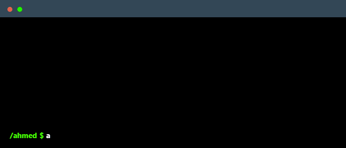

 

    

### About Me
I am an aspiring mobile app developer from Libya, currently a student at <a href="https://ar.cetb.edu.ly/">CETB</a>. I am exploring Flutter & Dart, and I have a passion for graphic design as a hobby.

### Skills

### Currently Learning

### Find Me On

    
    
    
    

